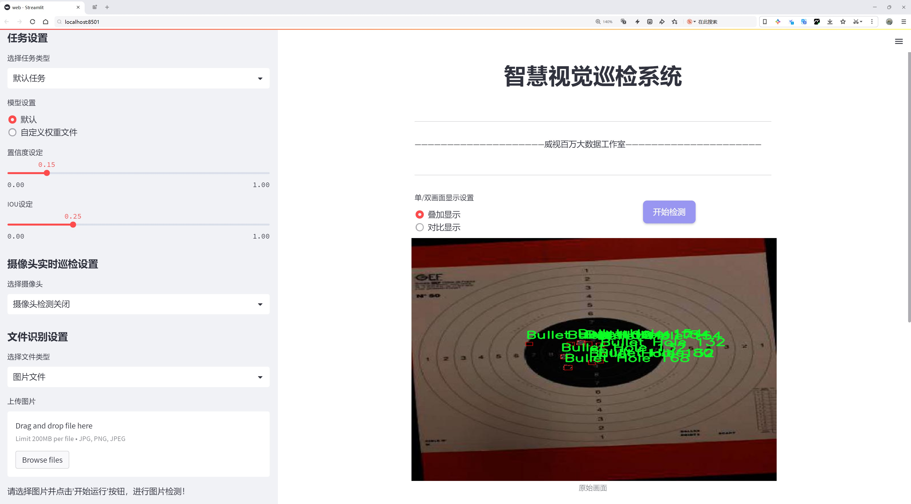
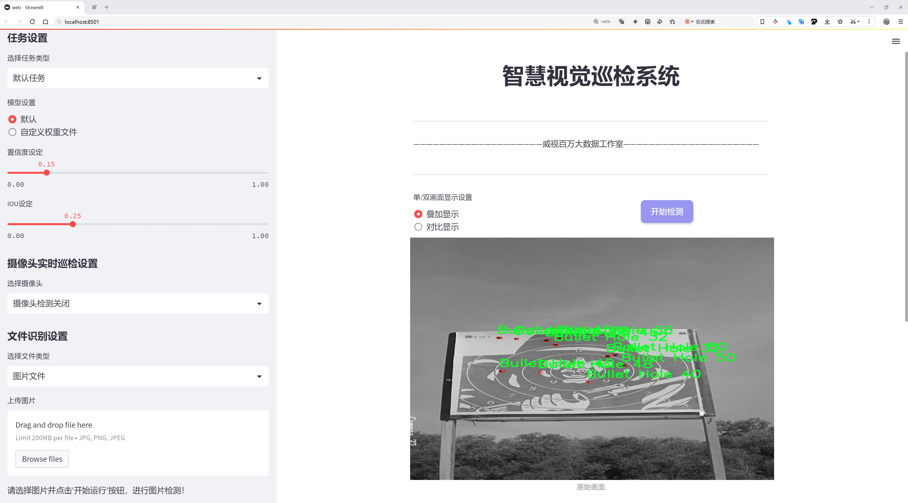
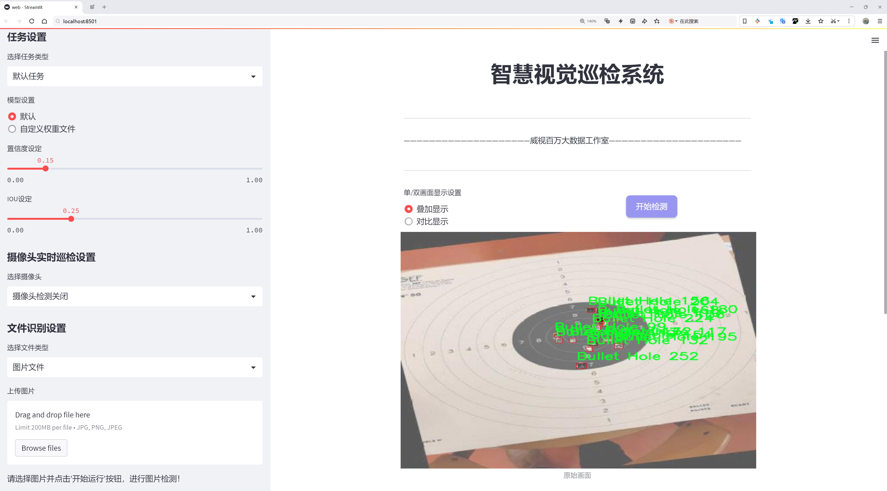
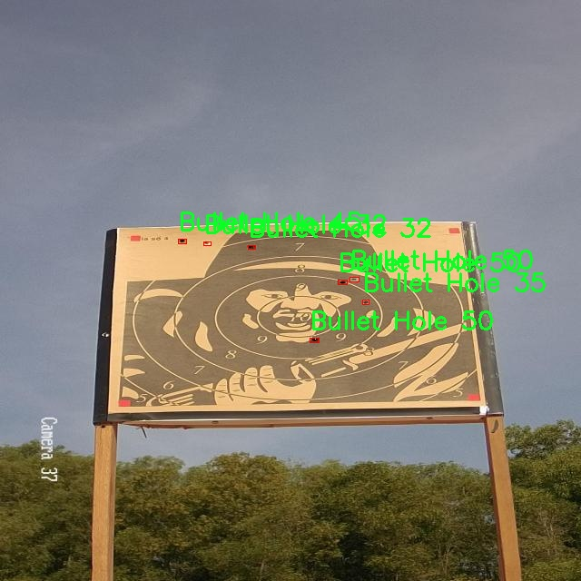
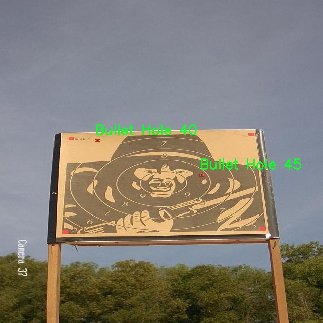
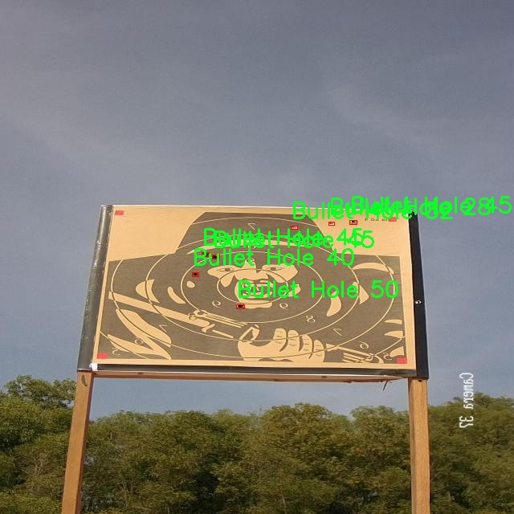
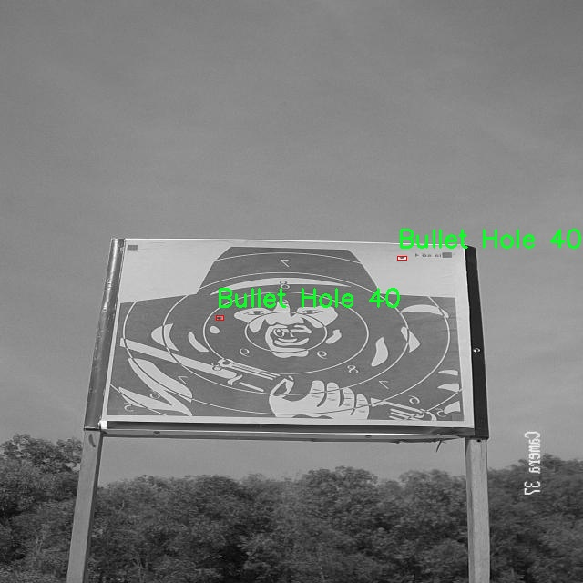

# 靶标弹孔检测系统源码分享
 # [一条龙教学YOLOV8标注好的数据集一键训练_70+全套改进创新点发刊_Web前端展示]

### 1.研究背景与意义

项目参考[AAAI Association for the Advancement of Artificial Intelligence](https://gitee.com/qunmasj/projects)

项目来源[AACV Association for the Advancement of Computer Vision](https://kdocs.cn/l/cszuIiCKVNis)

研究背景与意义

随着科技的不断进步，计算机视觉技术在各个领域的应用日益广泛，尤其是在安全监控、军事侦察和法医学等领域，靶标弹孔检测作为一种重要的图像分析任务，正受到越来越多的关注。传统的弹孔检测方法往往依赖于人工经验，效率低下且容易受到环境因素的影响，难以实现高精度和高效率的检测。因此，基于深度学习的自动化检测系统逐渐成为研究的热点。

YOLO（You Only Look Once）系列模型因其出色的实时性和准确性，成为目标检测领域的重要代表。YOLOv8作为该系列的最新版本，结合了更为先进的网络结构和训练策略，展现出更强的特征提取能力和更快的推理速度。然而，尽管YOLOv8在一般目标检测任务中表现优异，但在特定领域如弹孔检测时，仍然面临着诸多挑战。这些挑战包括弹孔在图像中的尺寸变化、形状多样性以及背景复杂性等。因此，改进YOLOv8以适应靶标弹孔检测的特定需求，具有重要的理论和实际意义。

本研究将基于一个包含3400张图像的专用数据集进行靶标弹孔检测系统的构建。该数据集仅包含一个类别——弹孔，专注于为模型提供高质量的训练样本。这种专一性使得模型能够更好地学习到弹孔的特征，从而提高检测的准确性和鲁棒性。通过对YOLOv8模型的改进，我们将引入多种数据增强技术，以提高模型在不同环境下的适应能力。此外，针对弹孔的特征，我们还将设计特定的损失函数，以优化模型在小目标检测和复杂背景下的表现。

在安全监控领域，靶标弹孔的快速、准确检测对于事件的及时响应和后续调查具有重要意义。通过实现高效的弹孔检测系统，能够大幅提升执法和安保人员的工作效率，降低人力成本，并提高事件处理的科学性和准确性。在法医学领域，弹孔的检测和分析对于案件的侦破至关重要，准确的弹孔定位和特征提取可以为案件提供重要的证据支持。因此，研究基于改进YOLOv8的靶标弹孔检测系统，不仅有助于推动计算机视觉技术在特定领域的应用，还能为相关行业提供切实可行的解决方案。

综上所述，基于改进YOLOv8的靶标弹孔检测系统的研究，不仅填补了现有技术在特定应用场景下的空白，也为未来相关研究提供了新的思路和方法。通过本研究的深入开展，我们期望能够为靶标弹孔检测领域的发展贡献新的理论和实践成果，推动相关技术的进步与应用。

### 2.图片演示







##### 注意：由于此博客编辑较早，上面“2.图片演示”和“3.视频演示”展示的系统图片或者视频可能为老版本，新版本在老版本的基础上升级如下：（实际效果以升级的新版本为准）

  （1）适配了YOLOV8的“目标检测”模型和“实例分割”模型，通过加载相应的权重（.pt）文件即可自适应加载模型。

  （2）支持“图片识别”、“视频识别”、“摄像头实时识别”三种识别模式。

  （3）支持“图片识别”、“视频识别”、“摄像头实时识别”三种识别结果保存导出，解决手动导出（容易卡顿出现爆内存）存在的问题，识别完自动保存结果并导出到tempDir中。

  （4）支持Web前端系统中的标题、背景图等自定义修改，后面提供修改教程。

  另外本项目提供训练的数据集和训练教程,暂不提供权重文件（best.pt）,需要您按照教程进行训练后实现图片演示和Web前端界面演示的效果。

### 3.视频演示

[3.1 视频演示](https://www.bilibili.com/video/BV1YW2EYAESz/)

### 4.数据集信息展示

##### 4.1 本项目数据集详细数据（类别数＆类别名）

nc: 1
names: ['Bullet Hole']


##### 4.2 本项目数据集信息介绍

数据集信息展示

在现代计算机视觉领域，目标检测技术的进步为多种应用场景提供了强有力的支持，尤其是在安全监控、法医分析以及军事领域中，靶标弹孔的检测显得尤为重要。为此，我们构建了一个专门用于训练和改进YOLOv8靶标弹孔检测系统的数据集，命名为“BulletPoints”。该数据集的设计旨在提供高质量的样本，以提高弹孔检测的准确性和鲁棒性。

“BulletPoints”数据集包含了丰富的图像数据，专注于靶标弹孔这一特定类别。该数据集的类别数量为1，类别名称为“Bullet Hole”。这一单一类别的选择，反映了我们对弹孔检测任务的专注与深度挖掘。数据集中包含的图像样本经过精心挑选，确保了其在不同场景、光照条件和背景下的多样性，以增强模型的泛化能力。

在数据采集过程中，我们采用了多种拍摄设备和技术，以确保数据的多样性和代表性。样本图像包括了不同类型的靶标表面，如纸质靶、金属靶和木质靶，涵盖了各种弹孔特征的表现。这些图像不仅展示了弹孔的形状、大小和颜色变化，还考虑了不同距离和角度下的拍摄效果，从而为模型训练提供了丰富的视觉信息。

此外，数据集中的每个图像都经过了精确的标注，确保每个弹孔的位置信息清晰可辨。我们采用了高标准的标注流程，确保标注的准确性和一致性，以便为YOLOv8模型的训练提供可靠的监督信号。这种高质量的标注将有助于模型在实际应用中更好地识别和定位弹孔，提高检测的精度和效率。

在数据集的构建过程中，我们还特别关注了数据的平衡性和代表性。尽管目前仅有一个类别，但我们确保在不同条件下的样本数量足够丰富，以避免模型在训练过程中出现偏差。通过对不同环境、不同材料和不同弹道特征的样本进行均衡采集，我们力求使模型能够在各种情况下都能表现出色。

为了便于研究人员和开发者使用，我们将“BulletPoints”数据集以开放的形式发布，鼓励学术界和工业界的同行们进行研究和应用。我们相信，通过这一数据集的使用，能够推动靶标弹孔检测技术的进一步发展，助力相关领域的研究和实践。

总之，“BulletPoints”数据集的构建不仅为YOLOv8靶标弹孔检测系统的训练提供了坚实的基础，也为未来的研究和应用奠定了良好的数据支持。我们期待这一数据集能够激发更多的创新思路，推动靶标检测技术的进步，为安全和法医领域的应用带来更大的价值。










### 5.全套项目环境部署视频教程（零基础手把手教学）

[5.1 环境部署教程链接（零基础手把手教学）](https://www.ixigua.com/7404473917358506534?logTag=c807d0cbc21c0ef59de5)


[5.2 安装Python虚拟环境创建和依赖库安装视频教程链接（零基础手把手教学）](https://www.ixigua.com/7404474678003106304?logTag=1f1041108cd1f708b01a)

### 6.手把手YOLOV8训练视频教程（零基础小白有手就能学会）

[6.1 手把手YOLOV8训练视频教程（零基础小白有手就能学会）](https://www.ixigua.com/7404477157818401292?logTag=d31a2dfd1983c9668658)


按照上面的训练视频教程链接加载项目提供的数据集，运行train.py即可开始训练



     Epoch   gpu_mem       box       obj       cls    labels  img_size
     1/200     20.8G   0.01576   0.01955  0.007536        22      1280: 100%|██████████| 849/849 [14:42<00:00,  1.04s/it]
               Class     Images     Labels          P          R     mAP@.5 mAP@.5:.95: 100%|██████████| 213/213 [01:14<00:00,  2.87it/s]
                 all       3395      17314      0.994      0.957      0.0957      0.0843

     Epoch   gpu_mem       box       obj       cls    labels  img_size
     2/200     20.8G   0.01578   0.01923  0.007006        22      1280: 100%|██████████| 849/849 [14:44<00:00,  1.04s/it]
               Class     Images     Labels          P          R     mAP@.5 mAP@.5:.95: 100%|██████████| 213/213 [01:12<00:00,  2.95it/s]
                 all       3395      17314      0.996      0.956      0.0957      0.0845

     Epoch   gpu_mem       box       obj       cls    labels  img_size
     3/200     20.8G   0.01561    0.0191  0.006895        27      1280: 100%|██████████| 849/849 [10:56<00:00,  1.29it/s]
               Class     Images     Labels          P          R     mAP@.5 mAP@.5:.95: 100%|███████   | 187/213 [00:52<00:00,  4.04it/s]
                 all       3395      17314      0.996      0.957      0.0957      0.0845


### 7.70+种全套YOLOV8创新点代码加载调参视频教程（一键加载写好的改进模型的配置文件）

[7.1 70+种全套YOLOV8创新点代码加载调参视频教程（一键加载写好的改进模型的配置文件）](https://www.ixigua.com/7404478314661806627?logTag=29066f8288e3f4eea3a4)

### 8.70+种全套YOLOV8创新点原理讲解（非科班也可以轻松写刊发刊，V10版本正在科研待更新）

#### 由于篇幅限制，每个创新点的具体原理讲解就不一一展开，具体见下列网址中的创新点对应子项目的技术原理博客网址【Blog】：


[8.1 70+种全套YOLOV8创新点原理讲解链接](https://gitee.com/qunmasj/good)

#### 部分改进原理讲解(完整的改进原理见上图和技术博客链接)
### YOLOv8简介

YOLOv8 是 Ultralytics 公司继 YOLOv5 算法之后开发的下一代算法模型，目前支持图像分类、物体检测和实例分割任务。YOLOv8 是一个 SOTA 模型，它建立在之前YOLO 系列模型的成功基础上，并引入了新的功能和改进，以进一步提升性能和灵活性。具体创新包括：一个新的骨干网络、一个新的 Ancher-Free 检测头和一个新的损失函数，可以在从 CPU 到 GPU 的各种硬件平台上运行。注意到ultralytics 并没有直接将开源库命名为 YOLOv8，而是直接使用 Ultralytics这个单词，原因是Ultralytics这个库的定位是算法框架，而非特指某一个特定算法，其希望这个库不仅仅能够用于 YOLO 系列模型，同时也能支持其他的视觉任务如图像分类、实例分割等。下图画图YOLOv8目标检测算法同其他YOLO系列算法（YOLOv5、6、7）的实验对比图，左边是模型参数量对比，右边是速度对比。


下面两个表分别是YOLOv8和YOLOv5（v7.0版本）官方在 COCO Val 2017 数据集上测试结果，从中看出 YOLOv8 相比 YOLOv5 精度提升大，但是 N/S/M 模型相应的参数量、FLOPS等提高了不少。


#### YOLOv8概述
提供了一个全新的SOTA模型，和YOLOv5一样，基于缩放系数也提供了 N/S/M/L/X 尺度的不同大小模型，用于满足不同场景需求，同时支持图像分类、目标检测、实例分割和姿态检测任务
在骨干网络和Neck部分将YOLOv5的C3结构换成了梯度流更丰富的 C2f 结构，并对不同尺度模型调整了不同的通道数，大幅提升了模型性能；需要注意的是C2f 模块中存在Split等操作对特定硬件部署没有之前那么友好


Head部分换成了目前主流的解耦头结构，将分类和检测头分离，同时也从 Anchor-Based换成了Anchor-Free Loss
计算方面采用了 TaskAlignedAssigner 正样本分配策略，并引入了 Distribution Focal Loss
下图画出YOLOv8目标检测算法的整体结构图


#### YOLOv8模型
YOLOv8目标检测算法的模型配置文件如下：


从配置文件可以看出，YOLOv8与YOLOv5模型最明显的差异是使用C2F模块替换了原来的C3模块，两个模块的结构图下图所示。


另外Head 部分变化最大，从原先的耦合头变成了解耦头，并且从 YOLOv5 的 Anchor-Based 变成了 Anchor-Free。其结构对比图如下所示：

### RepViT简介

近年来，与轻量级卷积神经网络(cnn)相比，轻量级视觉变压器(ViTs)在资源受限的移动设备上表现出了更高的性能和更低的延迟。这种改进通常归功于多头自注意模块，它使模型能够学习全局表示。然而，轻量级vit和轻量级cnn之间的架构差异还没有得到充分的研究。在这项研究中，我们重新审视了轻量级cnn的高效设计，并强调了它们在移动设备上的潜力。通过集成轻量级vit的高效架构选择，我们逐步增强了标准轻量级CNN的移动友好性，特别是MobileNetV3。这就产生了一个新的纯轻量级cnn家族，即RepViT。大量的实验表明，RepViT优于现有的轻型vit，并在各种视觉任务中表现出良好的延迟。在ImageNet上，RepViT在iPhone 12上以近1ms的延迟实现了超过80%的top-1精度，据我们所知，这是轻量级模型的第一次。

#### RepViT简介
轻量级模型研究一直是计算机视觉任务中的一个焦点，其目标是在降低计算成本的同时达到优秀的性能。轻量级模型与资源受限的移动设备尤其相关，使得视觉模型的边缘部署成为可能。在过去十年中，研究人员主要关注轻量级卷积神经网络（CNNs）的设计，提出了许多高效的设计原则，包括可分离卷积 、逆瓶颈结构 、通道打乱 和结构重参数化等，产生了 MobileNets ，ShuffleNets和 RepVGG 等代表性模型。

另一方面，视觉 Transformers（ViTs）成为学习视觉表征的另一种高效方案。与 CNNs 相比，ViTs 在各种计算机视觉任务中表现出了更优越的性能。然而，ViT 模型一般尺寸很大，延迟很高，不适合资源受限的移动设备。因此，研究人员开始探索 ViT 的轻量级设计。许多高效的ViTs设计原则被提出，大大提高了移动设备上 ViTs 的计算效率，产生了EfficientFormers ，MobileViTs等代表性模型。这些轻量级 ViTs 在移动设备上展现出了相比 CNNs 的更强的性能和更低的延迟。

轻量级 ViTs 优于轻量级 CNNs 的原因通常归结于多头注意力模块，该模块使模型能够学习全局表征。然而，轻量级 ViTs 和轻量级 CNNs 在块结构、宏观和微观架构设计方面存在值得注意的差异，但这些差异尚未得到充分研究。这自然引出了一个问题：轻量级 ViTs 的架构选择能否提高轻量级 CNN 的性能？在这项工作中，我们结合轻量级 ViTs 的架构选择，重新审视了轻量级 CNNs 的设计。我们的旨在缩小轻量级 CNNs 与轻量级 ViTs 之间的差距，并强调前者与后者相比在移动设备上的应用潜力。


在 ConvNeXt 中，参考该博客提出的基于 ResNet50 架构的基础上通过严谨的理论和实验分析，最终设计出一个非常优异的足以媲美 Swin-Transformer 的纯卷积神经网络架构。同样地，RepViT也是主要通过将轻量级 ViTs 的架构设计逐步整合到标准轻量级 CNN，即MobileNetV3-L，来对其进行针对性地改造（魔改）。在这个过程中，作者们考虑了不同粒度级别的设计元素，并通过一系列步骤达到优化的目标。


详细优化步骤如下：

#### 训练配方的对齐
论文中引入了一种衡量移动设备上延迟的指标，并将训练策略与现有的轻量级 ViTs 对齐。这一步骤主要是为了确保模型训练的一致性，其涉及两个概念，即延迟度量和训练策略的调整。

#### 延迟度量指标
为了更准确地衡量模型在真实移动设备上的性能，作者选择了直接测量模型在设备上的实际延迟，以此作为基准度量。这个度量方法不同于之前的研究，它们主要通过FLOPs或模型大小等指标优化模型的推理速度，这些指标并不总能很好地反映在移动应用中的实际延迟。

#### 训练策略的对齐
这里，将 MobileNetV3-L 的训练策略调整以与其他轻量级 ViTs 模型对齐。这包括使用 AdamW 优化器-ViTs 模型必备的优化器，进行 5 个 epoch 的预热训练，以及使用余弦退火学习率调度进行 300 个 epoch 的训练。尽管这种调整导致了模型准确率的略微下降，但可以保证公平性。

#### 块设计的优化
基于一致的训练设置，作者们探索了最优的块设计。块设计是 CNN 架构中的一个重要组成部分，优化块设计有助于提高网络的性能。

#### 分离 Token 混合器和通道混合器
这块主要是对 MobileNetV3-L 的块结构进行了改进，分离了令牌混合器和通道混合器。原来的 MobileNetV3 块结构包含一个 1x1 扩张卷积，然后是一个深度卷积和一个 1x1 的投影层，然后通过残差连接连接输入和输出。在此基础上，RepViT 将深度卷积提前，使得通道混合器和令牌混合器能够被分开。为了提高性能，还引入了结构重参数化来在训练时为深度滤波器引入多分支拓扑。最终，作者们成功地在 MobileNetV3 块中分离了令牌混合器和通道混合器，并将这种块命名为 RepViT 块。

#### 降低扩张比例并增加宽度
在通道混合器中，原本的扩张比例是 4，这意味着 MLP 块的隐藏维度是输入维度的四倍，消耗了大量的计算资源，对推理时间有很大的影响。为了缓解这个问题，我们可以将扩张比例降低到 2，从而减少了参数冗余和延迟，使得 MobileNetV3-L 的延迟降低到 0.65ms。随后，通过增加网络的宽度，即增加各阶段的通道数量，Top-1 准确率提高到 73.5%，而延迟只增加到 0.89ms！

#### 宏观架构元素的优化
在这一步，本文进一步优化了MobileNetV3-L在移动设备上的性能，主要是从宏观架构元素出发，包括 stem，降采样层，分类器以及整体阶段比例。通过优化这些宏观架构元素，模型的性能可以得到显著提高。

#### 浅层网络使用卷积提取器
ViTs 通常使用一个将输入图像分割成非重叠补丁的 “patchify” 操作作为 stem。然而，这种方法在训练优化性和对训练配方的敏感性上存在问题。因此，作者们采用了早期卷积来代替，这种方法已经被许多轻量级 ViTs 所采纳。对比之下，MobileNetV3-L 使用了一个更复杂的 stem 进行 4x 下采样。这样一来，虽然滤波器的初始数量增加到24，但总的延迟降低到0.86ms，同时 top-1 准确率提高到 73.9%。

#### 更深的下采样层
在 ViTs 中，空间下采样通常通过一个单独的补丁合并层来实现。因此这里我们可以采用一个单独和更深的下采样层，以增加网络深度并减少由于分辨率降低带来的信息损失。具体地，作者们首先使用一个 1x1 卷积来调整通道维度，然后将两个 1x1 卷积的输入和输出通过残差连接，形成一个前馈网络。此外，他们还在前面增加了一个 RepViT 块以进一步加深下采样层，这一步提高了 top-1 准确率到 75.4%，同时延迟为 0.96ms。

#### 更简单的分类器
在轻量级 ViTs 中，分类器通常由一个全局平均池化层后跟一个线性层组成。相比之下，MobileNetV3-L 使用了一个更复杂的分类器。因为现在最后的阶段有更多的通道，所以作者们将它替换为一个简单的分类器，即一个全局平均池化层和一个线性层，这一步将延迟降低到 0.77ms，同时 top-1 准确率为 74.8%。

#### 整体阶段比例
阶段比例代表了不同阶段中块数量的比例，从而表示了计算在各阶段中的分布。论文选择了一个更优的阶段比例 1:1:7:1，然后增加网络深度到 2:2:14:2，从而实现了一个更深的布局。这一步将 top-1 准确率提高到 76.9%，同时延迟为 1.02 ms。

#### 卷积核大小的选择
众所周知，CNNs 的性能和延迟通常受到卷积核大小的影响。例如，为了建模像 MHSA 这样的远距离上下文依赖，ConvNeXt 使用了大卷积核，从而实现了显著的性能提升。然而，大卷积核对于移动设备并不友好，因为它的计算复杂性和内存访问成本。MobileNetV3-L 主要使用 3x3 的卷积，有一部分块中使用 5x5 的卷积。作者们将它们替换为3x3的卷积，这导致延迟降低到 1.00ms，同时保持了76.9%的top-1准确率。

#### SE 层的位置
自注意力模块相对于卷积的一个优点是根据输入调整权重的能力，这被称为数据驱动属性。作为一个通道注意力模块，SE层可以弥补卷积在缺乏数据驱动属性上的限制，从而带来更好的性能。MobileNetV3-L 在某些块中加入了SE层，主要集中在后两个阶段。然而，与分辨率较高的阶段相比，分辨率较低的阶段从SE提供的全局平均池化操作中获得的准确率提升较小。作者们设计了一种策略，在所有阶段以交叉块的方式使用SE层，从而在最小的延迟增量下最大化准确率的提升，这一步将top-1准确率提升到77.4%，同时延迟降低到0.87ms。

注意！【这一点其实百度在很早前就已经做过实验比对得到过这个结论了，SE 层放置在靠近深层的地方效果好】

#### 微观设计的调整
RepViT 通过逐层微观设计来调整轻量级 CNN，这包括选择合适的卷积核大小和优化挤压-激励（Squeeze-and-excitation，简称SE）层的位置。这两种方法都能显著改善模型性能。

#### 网络架构
最终，通过整合上述改进策略，我们便得到了模型RepViT的整体架构，该模型有多个变种，例如RepViT-M1/M2/M3。同样地，不同的变种主要通过每个阶段的通道数和块数来区分。


### 9.系统功能展示（检测对象为举例，实际内容以本项目数据集为准）

图9.1.系统支持检测结果表格显示

  图9.2.系统支持置信度和IOU阈值手动调节

  图9.3.系统支持自定义加载权重文件best.pt(需要你通过步骤5中训练获得)

  图9.4.系统支持摄像头实时识别

  图9.5.系统支持图片识别

  图9.6.系统支持视频识别

  图9.7.系统支持识别结果文件自动保存

  图9.8.系统支持Excel导出检测结果数据


### 10.原始YOLOV8算法原理

原始YOLOv8算法原理

YOLOv8算法是YOLO系列目标检测算法的最新版本，承载着前几代算法的创新与改进，旨在进一步提升目标检测的精度与速度。YOLOv8的设计理念基于“实时性”和“准确性”的双重需求，特别是在复杂环境下的目标检测任务中，其性能表现尤为突出。YOLOv8的架构主要由输入模块、Backbone骨干网络、Neck特征融合网络和Head检测模块四个部分组成，形成了一个高效且灵活的检测系统。

在数据预处理方面，YOLOv8继承了YOLOv5的优良传统，采用了一系列增强手段来提升模型的鲁棒性。具体而言，马赛克增强（Mosaic）、混合增强（Mixup）、空间扰动（Random Perspective）和颜色扰动（HSV Augment）等技术被广泛应用于训练过程中。这些技术不仅丰富了训练数据的多样性，还有效提高了模型对不同场景和光照条件的适应能力，进而提升了检测精度。

YOLOv8的骨干网络结构在YOLOv5的基础上进行了优化，主要通过引入C2f模块替代了原有的C3模块。C2f模块的设计旨在增强梯度流动，增加网络的深度和宽度，使得特征提取更加丰富。C2f模块通过多分支结构，能够更好地捕捉到不同尺度的特征信息，这对于后续的目标检测至关重要。此外，YOLOv8在骨干网络中还使用了SPPF模块，通过不同内核尺寸的池化操作，进一步提升了特征图的表达能力，使得网络在处理复杂场景时更加游刃有余。

在特征融合方面，YOLOv8依然采用了FPN（特征金字塔网络）与PAN（路径聚合网络）的组合结构。FPN负责在不同尺度间进行特征的上下传递，而PAN则通过路径聚合进一步增强特征的融合效果。这种双塔结构的设计，使得YOLOv8能够有效整合来自不同层次的特征信息，确保在处理多尺度目标时的检测性能。通过这种特征融合机制，YOLOv8在面对大小不一的目标时，能够保持较高的检测精度。

YOLOv8的检测模块采用了解耦头结构，这一设计理念是从YOLOX引入的。解耦头将分类和定位任务分开处理，分别通过独立的分支进行特征提取和预测。这种结构的优势在于可以加速模型的收敛，提高训练效率，并且在一定程度上降低了任务间的干扰，使得模型在分类和定位上的表现更加出色。

在标签分配策略上，YOLOv8摒弃了依赖于候选框聚类的传统方法，转而采用了一种动态标签分配策略。具体而言，YOLOv8采用了TOOD策略，通过动态分配正负样本的标签，确保每个样本都能得到合理的训练反馈。这种策略的引入，极大地提升了模型在不同数据集上的适应性，尤其是在数据量不足或数据分布不均的情况下，能够有效避免过拟合和欠拟合的问题。

YOLOv8的损失函数设计也进行了创新，分类损失采用了VFL Loss（Varifocal Loss），而回归损失则结合了CIoULoss与DFLLoss。这种设计使得模型在训练过程中能够更加关注高质量的正样本，同时对负样本的影响进行有效抑制。VFL Loss通过不对称参数的使用，对正负样本进行加权处理，确保模型在学习过程中更加聚焦于重要的样本，提高了最终的检测精度。

总体而言，YOLOv8算法在多个方面进行了优化和改进，充分继承了YOLO系列的优良传统，同时又在新技术的支持下，展现出更强的目标检测能力。无论是在实时性还是准确性上，YOLOv8都表现出了显著的优势，成为了当前目标检测领域的重要工具。随着YOLOv8的不断发展与应用，其在实际场景中的表现也将不断得到验证和提升，为各类智能应用提供更为强大的支持。


### 11.项目核心源码讲解（再也不用担心看不懂代码逻辑）

#### 11.1 code\ultralytics\models\sam\__init__.py

以下是对提供代码的逐行分析和核心部分的保留，同时添加了详细的中文注释：

```python
# Ultralytics YOLO 🚀, AGPL-3.0 license

# 从当前包中导入SAM模型类
from .model import SAM

# 从当前包中导入预测器类
from .predict import Predictor

# 定义模块的公开接口，包含SAM和Predictor类
__all__ = "SAM", "Predictor"  # 这是一个元组，指定了可以被外部访问的类
```

### 代码分析与注释

1. **导入模块**：
   - `from .model import SAM`：从当前包的`model`模块中导入`SAM`类，`SAM`可能是一个用于目标检测或其他任务的模型。
   - `from .predict import Predictor`：从当前包的`predict`模块中导入`Predictor`类，`Predictor`可能是一个用于执行模型预测的工具。

2. **定义公开接口**：
   - `__all__ = "SAM", "Predictor"`：这是一个特殊变量，用于定义当使用`from module import *`语句时，哪些名称会被导入。这里指定了`SAM`和`Predictor`两个类，使得它们可以被外部模块访问。

### 核心部分
保留的核心部分主要是导入和定义公开接口的代码，因为它们是模块功能的基础。

这个文件是一个Python模块的初始化文件，位于Ultralytics YOLO项目的`models/sam`目录下。文件的主要功能是导入该模块中定义的类和函数，并定义模块的公共接口。

首先，文件顶部的注释部分标明了该项目是Ultralytics YOLO，并且使用AGPL-3.0许可证。这为用户提供了关于代码使用和分发的法律信息。

接下来，文件通过`from .model import SAM`语句导入了`model`模块中的`SAM`类。这意味着在其他地方使用这个模块时，可以直接使用`SAM`类而无需再次导入`model`模块。

同样，`from .predict import Predictor`语句导入了`predict`模块中的`Predictor`类。这样，用户在使用这个模块时也可以直接访问`Predictor`类。

最后，`__all__`变量被定义为一个元组，包含了`"SAM"`和`"Predictor"`两个字符串。这一行的作用是指定了当使用`from module import *`语句时，哪些名称会被导入。这是一种控制模块公共接口的方式，确保用户只能访问到这些指定的类，而不是模块中的所有内容。

总体而言，这个文件的主要作用是作为一个接口，简化了模块的使用，使得用户可以方便地访问`SAM`和`Predictor`这两个类。

#### 11.2 code\ultralytics\models\yolo\pose\val.py

以下是代码中最核心的部分，并附上详细的中文注释：

```python
class PoseValidator(DetectionValidator):
    """
    PoseValidator类，继承自DetectionValidator类，用于基于姿态模型的验证。
    """

    def __init__(self, dataloader=None, save_dir=None, pbar=None, args=None, _callbacks=None):
        """初始化PoseValidator对象，设置自定义参数和属性。"""
        super().__init__(dataloader, save_dir, pbar, args, _callbacks)  # 调用父类构造函数
        self.sigma = None  # 用于计算关键点的标准差
        self.kpt_shape = None  # 关键点的形状
        self.args.task = "pose"  # 设置任务类型为姿态估计
        self.metrics = PoseMetrics(save_dir=self.save_dir, on_plot=self.on_plot)  # 初始化姿态度量指标

    def preprocess(self, batch):
        """预处理批次数据，将关键点数据转换为浮点数并移动到设备上。"""
        batch = super().preprocess(batch)  # 调用父类的预处理方法
        batch["keypoints"] = batch["keypoints"].to(self.device).float()  # 将关键点数据转换为浮点数并移动到指定设备
        return batch

    def postprocess(self, preds):
        """应用非极大值抑制，返回高置信度的检测结果。"""
        return ops.non_max_suppression(
            preds,
            self.args.conf,  # 置信度阈值
            self.args.iou,  # IOU阈值
            labels=self.lb,
            multi_label=True,
            agnostic=self.args.single_cls,
            max_det=self.args.max_det,
            nc=self.nc,
        )

    def update_metrics(self, preds, batch):
        """更新度量指标。"""
        for si, pred in enumerate(preds):  # 遍历每个预测结果
            self.seen += 1  # 记录已处理的样本数量
            npr = len(pred)  # 当前预测的数量
            stat = dict(
                conf=torch.zeros(0, device=self.device),  # 初始化置信度
                pred_cls=torch.zeros(0, device=self.device),  # 初始化预测类别
                tp=torch.zeros(npr, self.niou, dtype=torch.bool, device=self.device),  # 初始化真阳性
                tp_p=torch.zeros(npr, self.niou, dtype=torch.bool, device=self.device),  # 初始化姿态真阳性
            )
            pbatch = self._prepare_batch(si, batch)  # 准备当前批次数据
            cls, bbox = pbatch.pop("cls"), pbatch.pop("bbox")  # 获取类别和边界框
            
            if npr == 0:  # 如果没有预测结果
                if len(cls):  # 如果有真实类别
                    for k in self.stats.keys():
                        self.stats[k].append(stat[k])  # 更新统计信息
                continue  # 跳过当前循环

            predn, pred_kpts = self._prepare_pred(pred, pbatch)  # 准备预测结果和关键点
            stat["conf"] = predn[:, 4]  # 获取置信度
            stat["pred_cls"] = predn[:, 5]  # 获取预测类别

            if len(cls):  # 如果有真实类别
                stat["tp"] = self._process_batch(predn, bbox, cls)  # 处理批次，更新真阳性
                stat["tp_p"] = self._process_batch(predn, bbox, cls, pred_kpts, pbatch["kpts"])  # 处理姿态关键点
            for k in self.stats.keys():
                self.stats[k].append(stat[k])  # 更新统计信息

    def _process_batch(self, detections, gt_bboxes, gt_cls, pred_kpts=None, gt_kpts=None):
        """
        返回正确的预测矩阵。

        参数:
            detections (torch.Tensor): 形状为[N, 6]的检测结果张量。
            gt_bboxes (torch.Tensor): 形状为[M, 5]的真实标签张量。
            pred_kpts (torch.Tensor, 可选): 形状为[N, 51]的预测关键点张量。
            gt_kpts (torch.Tensor, 可选): 形状为[N, 51]的真实关键点张量。

        返回:
            torch.Tensor: 形状为[N, 10]的正确预测矩阵，表示10个IOU水平。
        """
        if pred_kpts is not None and gt_kpts is not None:
            area = ops.xyxy2xywh(gt_bboxes)[:, 2:].prod(1) * 0.53  # 计算区域
            iou = kpt_iou(gt_kpts, pred_kpts, sigma=self.sigma, area=area)  # 计算关键点IOU
        else:  # 如果没有关键点
            iou = box_iou(gt_bboxes, detections[:, :4])  # 计算边界框IOU

        return self.match_predictions(detections[:, 5], gt_cls, iou)  # 匹配预测结果与真实标签

    def plot_val_samples(self, batch, ni):
        """绘制并保存验证集样本，包括预测的边界框和关键点。"""
        plot_images(
            batch["img"],
            batch["batch_idx"],
            batch["cls"].squeeze(-1),
            batch["bboxes"],
            kpts=batch["keypoints"],
            paths=batch["im_file"],
            fname=self.save_dir / f"val_batch{ni}_labels.jpg",
            names=self.names,
            on_plot=self.on_plot,
        )

    def pred_to_json(self, predn, filename):
        """将YOLO预测结果转换为COCO JSON格式。"""
        stem = Path(filename).stem
        image_id = int(stem) if stem.isnumeric() else stem  # 获取图像ID
        box = ops.xyxy2xywh(predn[:, :4])  # 转换为xywh格式
        box[:, :2] -= box[:, 2:] / 2  # 将中心坐标转换为左上角坐标
        for p, b in zip(predn.tolist(), box.tolist()):
            self.jdict.append(
                {
                    "image_id": image_id,
                    "category_id": self.class_map[int(p[5])],
                    "bbox": [round(x, 3) for x in b],
                    "keypoints": p[6:],
                    "score": round(p[4], 5),
                }
            )
```

### 代码核心部分说明：
1. **PoseValidator类**：该类用于处理姿态估计的验证，继承自DetectionValidator，包含初始化、预处理、后处理、更新指标等方法。
2. **预处理方法**：将输入批次中的关键点数据转换为浮点数并移动到指定设备。
3. **后处理方法**：使用非极大值抑制来过滤低置信度的检测结果。
4. **更新指标方法**：计算并更新模型的性能指标，包括真阳性、置信度等。
5. **处理批次方法**：计算预测结果与真实标签之间的匹配情况，返回正确的预测矩阵。
6. **绘制验证样本**：将验证集样本及其预测结果可视化。
7. **转换为JSON格式**：将预测结果转换为COCO格式的JSON，以便后续评估和使用。

这个程序文件定义了一个名为 `PoseValidator` 的类，继承自 `DetectionValidator`，用于基于姿态模型的验证。它主要用于处理与姿态估计相关的任务，利用 YOLO（You Only Look Once）模型进行目标检测和关键点预测。

在初始化方法中，`PoseValidator` 接收一些参数并调用父类的初始化方法。它设置了一些特定于姿态估计的属性，如 `sigma` 和 `kpt_shape`，并初始化姿态度量的对象 `PoseMetrics`。如果设备是 Apple 的 MPS（Metal Performance Shaders），则会发出警告，建议使用 CPU。

`preprocess` 方法负责对输入批次进行预处理，将关键点数据转换为浮点数并移动到指定设备上。`get_desc` 方法返回评估指标的描述字符串，方便后续输出。

在 `postprocess` 方法中，程序应用非极大值抑制（NMS）来过滤低置信度的检测结果。`init_metrics` 方法用于初始化与姿态估计相关的度量指标，确定关键点的形状并设置相应的 `sigma` 值。

`_prepare_batch` 和 `_prepare_pred` 方法分别用于准备输入批次和预测结果，确保关键点数据正确缩放并适应模型输入要求。`update_metrics` 方法用于更新模型的评估指标，处理每个预测结果并与真实标签进行比较，计算正确预测的数量。

`_process_batch` 方法则负责返回正确的预测矩阵，计算预测框与真实框之间的 IoU（Intersection over Union），并进行匹配。`plot_val_samples` 和 `plot_predictions` 方法用于可视化验证样本和模型预测结果，生成带有预测框和关键点的图像。

`pred_to_json` 方法将 YOLO 的预测结果转换为 COCO JSON 格式，以便后续评估。`eval_json` 方法则用于评估模型的性能，使用 COCO 格式的 JSON 文件进行 mAP（mean Average Precision）计算，确保所需的文件存在并使用 `pycocotools` 进行评估。

总体来说，这个文件实现了姿态估计模型的验证流程，包括数据预处理、模型预测、指标更新、结果可视化和性能评估等功能。

#### 11.3 ui.py

以下是保留的核心代码部分，并添加了详细的中文注释：

```python
import sys
import subprocess

def run_script(script_path):
    """
    使用当前 Python 环境运行指定的脚本。

    Args:
        script_path (str): 要运行的脚本路径

    Returns:
        None
    """
    # 获取当前 Python 解释器的路径
    python_path = sys.executable

    # 构建运行命令，使用 streamlit 运行指定的脚本
    command = f'"{python_path}" -m streamlit run "{script_path}"'

    # 执行命令，并等待其完成
    result = subprocess.run(command, shell=True)
    
    # 检查命令执行的返回码，如果不为0则表示出错
    if result.returncode != 0:
        print("脚本运行出错。")

# 实例化并运行应用
if __name__ == "__main__":
    # 指定要运行的脚本路径
    script_path = "web.py"  # 假设脚本在当前目录下

    # 调用函数运行脚本
    run_script(script_path)
```

### 代码注释说明：
1. **导入模块**：
   - `sys`：用于获取当前 Python 解释器的路径。
   - `subprocess`：用于执行外部命令。

2. **`run_script` 函数**：
   - 该函数接收一个脚本路径作为参数，并使用当前 Python 环境运行该脚本。
   - 使用 `sys.executable` 获取当前 Python 解释器的路径。
   - 构建一个命令字符串，使用 `streamlit` 模块运行指定的脚本。
   - 使用 `subprocess.run` 执行构建的命令，并等待其完成。
   - 检查命令的返回码，如果返回码不为0，表示脚本运行出错，并打印错误信息。

3. **主程序块**：
   - 在主程序中，指定要运行的脚本路径（假设为 "web.py"）。
   - 调用 `run_script` 函数，传入脚本路径以执行该脚本。

这个程序文件的主要功能是使用当前的 Python 环境来运行一个指定的脚本，具体是一个名为 `web.py` 的文件。程序首先导入了必要的模块，包括 `sys`、`os` 和 `subprocess`，以及一个自定义的路径处理模块 `abs_path`。

在 `run_script` 函数中，首先获取当前 Python 解释器的路径，这样可以确保在正确的环境中运行脚本。接着，构建一个命令字符串，这个命令使用了 `streamlit` 模块来运行指定的脚本。`streamlit` 是一个用于构建数据应用的库，因此这个程序的目的可能是启动一个基于 `streamlit` 的 web 应用。

然后，使用 `subprocess.run` 方法来执行构建好的命令。这个方法会在一个新的 shell 中运行命令，并等待其完成。如果命令执行后返回的状态码不为零，表示脚本运行过程中出现了错误，此时程序会打印出一条错误信息。

在文件的最后部分，使用 `if __name__ == "__main__":` 语句来确保只有在直接运行该文件时才会执行后面的代码。在这里，指定了要运行的脚本路径 `web.py`，并调用 `run_script` 函数来执行它。

总的来说，这个程序的作用是便捷地启动一个 `streamlit` 应用，允许用户在当前 Python 环境中运行指定的脚本，并处理可能出现的错误。

#### 11.4 train.py

以下是经过简化并注释的核心代码部分：

```python
import random
import numpy as np
import torch.nn as nn
from ultralytics.data import build_dataloader, build_yolo_dataset
from ultralytics.engine.trainer import BaseTrainer
from ultralytics.models import yolo
from ultralytics.nn.tasks import DetectionModel
from ultralytics.utils import LOGGER, RANK
from ultralytics.utils.torch_utils import de_parallel, torch_distributed_zero_first

class DetectionTrainer(BaseTrainer):
    """
    DetectionTrainer类用于基于YOLO模型进行目标检测的训练。
    """

    def build_dataset(self, img_path, mode="train", batch=None):
        """
        构建YOLO数据集。

        参数:
            img_path (str): 包含图像的文件夹路径。
            mode (str): 模式，`train`或`val`，用户可以为每种模式自定义不同的增强。
            batch (int, optional): 批次大小，适用于`rect`模式。默认为None。
        """
        gs = max(int(de_parallel(self.model).stride.max() if self.model else 0), 32)  # 获取模型的最大步幅
        return build_yolo_dataset(self.args, img_path, batch, self.data, mode=mode, rect=mode == "val", stride=gs)

    def get_dataloader(self, dataset_path, batch_size=16, rank=0, mode="train"):
        """构造并返回数据加载器。"""
        assert mode in ["train", "val"]  # 确保模式有效
        with torch_distributed_zero_first(rank):  # 仅在DDP时初始化数据集*.cache一次
            dataset = self.build_dataset(dataset_path, mode, batch_size)  # 构建数据集
        shuffle = mode == "train"  # 训练模式下打乱数据
        workers = self.args.workers if mode == "train" else self.args.workers * 2  # 根据模式设置工作线程数
        return build_dataloader(dataset, batch_size, workers, shuffle, rank)  # 返回数据加载器

    def preprocess_batch(self, batch):
        """对图像批次进行预处理，包括缩放和转换为浮点数。"""
        batch["img"] = batch["img"].to(self.device, non_blocking=True).float() / 255  # 将图像转换为浮点数并归一化
        if self.args.multi_scale:  # 如果启用多尺度
            imgs = batch["img"]
            sz = (
                random.randrange(self.args.imgsz * 0.5, self.args.imgsz * 1.5 + self.stride)
                // self.stride
                * self.stride
            )  # 随机选择图像大小
            sf = sz / max(imgs.shape[2:])  # 计算缩放因子
            if sf != 1:
                ns = [
                    math.ceil(x * sf / self.stride) * self.stride for x in imgs.shape[2:]
                ]  # 计算新的图像形状
                imgs = nn.functional.interpolate(imgs, size=ns, mode="bilinear", align_corners=False)  # 进行插值缩放
            batch["img"] = imgs  # 更新批次图像
        return batch

    def get_model(self, cfg=None, weights=None, verbose=True):
        """返回YOLO目标检测模型。"""
        model = DetectionModel(cfg, nc=self.data["nc"], verbose=verbose and RANK == -1)  # 创建检测模型
        if weights:
            model.load(weights)  # 加载权重
        return model

    def plot_training_samples(self, batch, ni):
        """绘制带有注释的训练样本。"""
        plot_images(
            images=batch["img"],
            batch_idx=batch["batch_idx"],
            cls=batch["cls"].squeeze(-1),
            bboxes=batch["bboxes"],
            paths=batch["im_file"],
            fname=self.save_dir / f"train_batch{ni}.jpg",
            on_plot=self.on_plot,
        )

    def plot_metrics(self):
        """从CSV文件中绘制指标。"""
        plot_results(file=self.csv, on_plot=self.on_plot)  # 保存结果图
```

### 代码说明：
1. **DetectionTrainer类**：该类用于训练YOLO目标检测模型，继承自`BaseTrainer`。
2. **build_dataset方法**：构建YOLO数据集，接受图像路径、模式和批次大小作为参数。
3. **get_dataloader方法**：构造数据加载器，确保在分布式训练时只初始化一次数据集。
4. **preprocess_batch方法**：对输入的图像批次进行预处理，包括归一化和可能的多尺度调整。
5. **get_model方法**：返回一个YOLO目标检测模型，可以选择加载预训练权重。
6. **plot_training_samples方法**：绘制训练样本及其注释，用于可视化训练过程。
7. **plot_metrics方法**：从CSV文件中绘制训练指标，帮助监控训练效果。

这个程序文件 `train.py` 是一个用于训练 YOLO（You Only Look Once）目标检测模型的实现，继承自 `BaseTrainer` 类。它主要负责构建数据集、加载数据、预处理图像、设置模型属性、获取模型、验证模型、记录损失、绘制训练样本和指标等功能。

在程序的开头，导入了一些必要的库和模块，包括数学运算、随机数生成、深度学习相关的库以及 YOLO 模型和数据处理的工具。接着定义了 `DetectionTrainer` 类，这个类是用于训练目标检测模型的核心部分。

`build_dataset` 方法用于构建 YOLO 数据集。它接收图像路径、模式（训练或验证）和批量大小作为参数，并调用 `build_yolo_dataset` 函数来生成数据集。该方法还会根据模型的步幅（stride）确定图像的大小。

`get_dataloader` 方法则负责构建并返回数据加载器。它会根据模式（训练或验证）来决定是否打乱数据，并设置工作线程的数量。通过调用 `build_dataloader` 函数，最终返回一个可以迭代的数据加载器。

`preprocess_batch` 方法用于对图像批次进行预处理，包括将图像缩放到适当的大小并转换为浮点数格式。该方法还支持多尺度训练，通过随机选择图像大小来增强模型的鲁棒性。

`set_model_attributes` 方法用于设置模型的属性，包括类别数量和类别名称等。这些信息将被传递给模型，以便于在训练过程中使用。

`get_model` 方法用于返回一个 YOLO 检测模型。它可以根据配置文件和权重文件来加载模型。

`get_validator` 方法返回一个用于验证 YOLO 模型的验证器，主要用于评估模型在验证集上的表现。

`label_loss_items` 方法用于返回一个包含训练损失项的字典，便于记录和监控训练过程中的损失变化。

`progress_string` 方法生成一个格式化的字符串，用于显示训练进度，包括当前的轮次、GPU 内存使用情况、损失值、实例数量和图像大小等信息。

`plot_training_samples` 方法用于绘制训练样本及其标注，帮助可视化训练数据的质量。

最后，`plot_metrics` 和 `plot_training_labels` 方法分别用于绘制训练过程中的指标和创建带标签的训练图，帮助分析模型的训练效果。

总体而言，这个文件实现了 YOLO 模型训练的多个关键步骤，为用户提供了一个结构化的训练框架。

#### 11.5 70+种YOLOv8算法改进源码大全和调试加载训练教程（非必要）\ultralytics\models\sam\build.py

以下是代码中最核心的部分，并附上详细的中文注释：

```python
import torch
from functools import partial
from ultralytics.utils.downloads import attempt_download_asset
from .modules.decoders import MaskDecoder
from .modules.encoders import ImageEncoderViT, PromptEncoder
from .modules.sam import Sam
from .modules.tiny_encoder import TinyViT
from .modules.transformer import TwoWayTransformer

def _build_sam(encoder_embed_dim,
               encoder_depth,
               encoder_num_heads,
               encoder_global_attn_indexes,
               checkpoint=None,
               mobile_sam=False):
    """构建选定的SAM模型架构。"""
    
    # 定义提示嵌入维度和图像大小
    prompt_embed_dim = 256
    image_size = 1024
    vit_patch_size = 16
    image_embedding_size = image_size // vit_patch_size  # 计算图像嵌入大小

    # 根据是否为移动版本选择不同的图像编码器
    image_encoder = (TinyViT(
        img_size=1024,
        in_chans=3,
        num_classes=1000,
        embed_dims=encoder_embed_dim,
        depths=encoder_depth,
        num_heads=encoder_num_heads,
        window_sizes=[7, 7, 14, 7],
        mlp_ratio=4.0,
        drop_rate=0.0,
        drop_path_rate=0.0,
        use_checkpoint=False,
        mbconv_expand_ratio=4.0,
        local_conv_size=3,
    ) if mobile_sam else ImageEncoderViT(
        depth=encoder_depth,
        embed_dim=encoder_embed_dim,
        img_size=image_size,
        mlp_ratio=4,
        norm_layer=partial(torch.nn.LayerNorm, eps=1e-6),
        num_heads=encoder_num_heads,
        patch_size=vit_patch_size,
        qkv_bias=True,
        use_rel_pos=True,
        global_attn_indexes=encoder_global_attn_indexes,
        window_size=14,
        out_chans=prompt_embed_dim,
    ))

    # 创建SAM模型
    sam = Sam(
        image_encoder=image_encoder,  # 图像编码器
        prompt_encoder=PromptEncoder(
            embed_dim=prompt_embed_dim,
            image_embedding_size=(image_embedding_size, image_embedding_size),
            input_image_size=(image_size, image_size),
            mask_in_chans=16,
        ),
        mask_decoder=MaskDecoder(
            num_multimask_outputs=3,
            transformer=TwoWayTransformer(
                depth=2,
                embedding_dim=prompt_embed_dim,
                mlp_dim=2048,
                num_heads=8,
            ),
            transformer_dim=prompt_embed_dim,
            iou_head_depth=3,
            iou_head_hidden_dim=256,
        ),
        pixel_mean=[123.675, 116.28, 103.53],  # 图像像素均值
        pixel_std=[58.395, 57.12, 57.375],  # 图像像素标准差
    )

    # 如果提供了检查点，则加载模型权重
    if checkpoint is not None:
        checkpoint = attempt_download_asset(checkpoint)  # 尝试下载检查点
        with open(checkpoint, 'rb') as f:
            state_dict = torch.load(f)  # 加载权重
        sam.load_state_dict(state_dict)  # 将权重加载到模型中

    sam.eval()  # 设置模型为评估模式
    return sam  # 返回构建的SAM模型
```

### 代码核心部分说明：
1. **导入必要的库和模块**：导入了PyTorch和一些自定义模块，准备构建模型。
2. **`_build_sam`函数**：该函数是构建SAM模型的核心部分，接收多个参数以定义模型的结构。
3. **图像编码器选择**：根据是否为移动版本选择不同的图像编码器（`TinyViT`或`ImageEncoderViT`）。
4. **SAM模型构建**：创建`Sam`对象，包含图像编码器、提示编码器和掩码解码器。
5. **权重加载**：如果提供了检查点，尝试下载并加载模型权重。
6. **模型评估模式**：将模型设置为评估模式，以便在推理时使用。

该程序文件是用于构建和加载“Segment Anything Model”（SAM）模型的代码，主要涉及不同尺寸的模型构建以及模型的初始化和加载。代码中使用了PyTorch框架，并且定义了一些函数来构建不同类型的SAM模型。

首先，文件导入了一些必要的库和模块，包括`torch`和一些自定义的模块，如`MaskDecoder`、`ImageEncoderViT`、`PromptEncoder`等。这些模块是构建SAM模型所需的核心组件。

接下来，文件定义了多个构建函数，如`build_sam_vit_h`、`build_sam_vit_l`、`build_sam_vit_b`和`build_mobile_sam`，它们分别用于构建不同尺寸的SAM模型。每个函数都调用了一个内部函数`_build_sam`，并传入特定的参数，例如编码器的嵌入维度、深度、头数等。这些参数的不同组合决定了模型的复杂性和性能。

`_build_sam`函数是模型构建的核心，负责创建具体的模型架构。它根据传入的参数选择使用`TinyViT`或`ImageEncoderViT`作为图像编码器，并初始化其他组件，如提示编码器和掩码解码器。该函数还设置了一些图像处理的参数，如图像大小和嵌入维度。

在模型构建完成后，如果提供了检查点（checkpoint），程序会尝试下载并加载该检查点的权重，以便恢复模型的状态。最后，模型被设置为评估模式（eval），准备进行推理。

文件的最后部分定义了一个字典`samm_model_map`，将模型名称映射到相应的构建函数。`build_sam`函数则是一个接口函数，根据给定的检查点名称选择合适的构建函数并返回构建好的模型。如果提供的检查点不在支持的模型列表中，程序会抛出一个文件未找到的异常。

总的来说，该程序文件实现了SAM模型的构建和加载功能，提供了灵活的接口以支持不同尺寸和类型的模型，适用于图像分割等任务。

#### 11.6 70+种YOLOv8算法改进源码大全和调试加载训练教程（非必要）\ultralytics\nn\__init__.py

```python
# 导入所需的模型任务类和函数
from .tasks import (BaseModel, ClassificationModel, DetectionModel, SegmentationModel, 
                    attempt_load_one_weight, attempt_load_weights, guess_model_scale, 
                    guess_model_task, parse_model, torch_safe_load, yaml_model_load)

# 定义模块的公开接口，包含可以被外部访问的类和函数
__all__ = ('attempt_load_one_weight', 'attempt_load_weights', 'parse_model', 
           'yaml_model_load', 'guess_model_task', 'guess_model_scale', 
           'torch_safe_load', 'DetectionModel', 'SegmentationModel', 
           'ClassificationModel', 'BaseModel')
```

### 代码注释说明：

1. **导入模块**：
   - 从当前包的 `tasks` 模块中导入了多个类和函数。这些类和函数是构建和使用模型所需的核心组件。
   - `BaseModel` 是所有模型的基类，其他模型（如分类、检测和分割模型）都继承自它。
   - `attempt_load_one_weight` 和 `attempt_load_weights` 是用于加载模型权重的函数。
   - `guess_model_scale` 和 `guess_model_task` 用于推测模型的规模和任务类型。
   - `parse_model` 用于解析模型结构。
   - `torch_safe_load` 和 `yaml_model_load` 用于安全地加载 PyTorch 模型和 YAML 配置文件。

2. **定义公开接口**：
   - `__all__` 列表定义了该模块的公共接口，只有在使用 `from module import *` 时，列出的名称才会被导入。这有助于控制模块的可见性，避免不必要的名称冲突。

这个程序文件是YOLO（You Only Look Once）系列算法的一个模块，主要用于导入和管理与模型相关的功能。文件的开头有一个注释，表明这是Ultralytics YOLO的代码，并且遵循AGPL-3.0许可证。

在代码中，首先从当前目录下的`tasks`模块导入了一系列的类和函数。这些导入的内容包括基础模型类（`BaseModel`）、分类模型类（`ClassificationModel`）、检测模型类（`DetectionModel`）、分割模型类（`SegmentationModel`），以及一些与模型加载和解析相关的函数，如`attempt_load_one_weight`、`attempt_load_weights`、`guess_model_scale`、`guess_model_task`、`parse_model`、`torch_safe_load`和`yaml_model_load`。

最后，使用`__all__`定义了一个公开接口，列出了可以被外部访问的名称。这意味着当其他模块使用`from module import *`时，只会导入这些指定的名称。这种做法有助于控制模块的公共API，避免不必要的名称冲突，同时使得代码的可读性和可维护性更强。

总的来说，这个文件的主要功能是组织和导入YOLOv8相关的模型和工具函数，为后续的模型训练和推理提供基础支持。

### 12.系统整体结构（节选）

### 整体功能和构架概括

该程序整体上是一个基于YOLO（You Only Look Once）系列算法的深度学习框架，主要用于目标检测和图像分割任务。框架的设计结构清晰，模块化程度高，便于扩展和维护。核心功能包括模型的构建、训练、验证、推理和结果可视化。通过多个模块和文件，用户可以方便地加载不同类型的模型、处理数据集、进行训练和评估，以及可视化训练过程和结果。

以下是各个文件的功能整理：

| 文件路径                                                                                          | 功能描述                                                                                          |
|---------------------------------------------------------------------------------------------------|---------------------------------------------------------------------------------------------------|
| `code\ultralytics\models\sam\__init__.py`                                                       | 初始化SAM模型模块，导入相关类和函数，简化模块使用。                                               |
| `code\ultralytics\models\yolo\pose\val.py`                                                      | 实现姿态估计模型的验证流程，包括数据预处理、模型预测、指标更新和结果可视化。                      |
| `ui.py`                                                                                           | 启动一个基于Streamlit的Web应用，便于用户交互和可视化模型结果。                                     |
| `train.py`                                                                                        | 负责YOLO模型的训练过程，包括数据集构建、模型初始化、损失记录和训练样本可视化等功能。              |
| `70+种YOLOv8算法改进源码大全和调试加载训练教程（非必要）\ultralytics\models\sam\build.py`      | 构建和加载SAM模型，支持不同尺寸的模型构建和权重加载。                                            |
| `70+种YOLOv8算法改进源码大全和调试加载训练教程（非必要）\ultralytics\nn\__init__.py`         | 导入和管理与YOLO模型相关的功能，包括模型类和工具函数的组织。                                     |
| `70+种YOLOv8算法改进源码大全和调试加载训练教程（非必要）\ultralytics\data\base.py`           | 定义数据集的基本类和方法，为数据加载和处理提供基础支持。                                         |
| `70+种YOLOv8算法改进源码大全和调试加载训练教程（非必要）\ultralytics\models\fastsam\val.py`  | 实现FastSAM模型的验证流程，类似于`val.py`文件，但针对FastSAM模型。                               |
| `code\ultralytics\data\explorer\__init__.py`                                                    | 初始化数据探索模块，提供数据集可视化和分析功能。                                                 |
| `code\ultralytics\models\utils\__init__.py`                                                    | 导入和管理与模型相关的工具函数，提供辅助功能。                                                   |
| `70+种YOLOv8算法改进源码大全和调试加载训练教程（非必要）\ultralytics\models\yolo\classify\__init__.py` | 初始化YOLO分类模型模块，导入相关类和函数，简化分类模型的使用。                                   |
| `code\ultralytics\assets\utils\__init__.py`                                                    | 导入和管理与资产相关的工具函数，提供辅助功能。                                                   |
| `code\ultralytics\solutions\distance_calculation.py`                                            | 实现距离计算相关的功能，可能用于目标检测或跟踪任务中的距离测量。                                   |

以上表格总结了各个文件的主要功能，展示了整个项目的模块化设计和功能分布。通过这些模块，用户可以高效地进行目标检测和图像分割任务的开发和研究。

注意：由于此博客编辑较早，上面“11.项目核心源码讲解（再也不用担心看不懂代码逻辑）”中部分代码可能会优化升级，仅供参考学习，完整“训练源码”、“Web前端界面”和“70+种创新点源码”以“13.完整训练+Web前端界面+70+种创新点源码、数据集获取”的内容为准。

### 13.完整训练+Web前端界面+70+种创新点源码、数据集获取


# [下载链接：https://mbd.pub/o/bread/ZpyXlJ5s](https://mbd.pub/o/bread/ZpyXlJ5s)